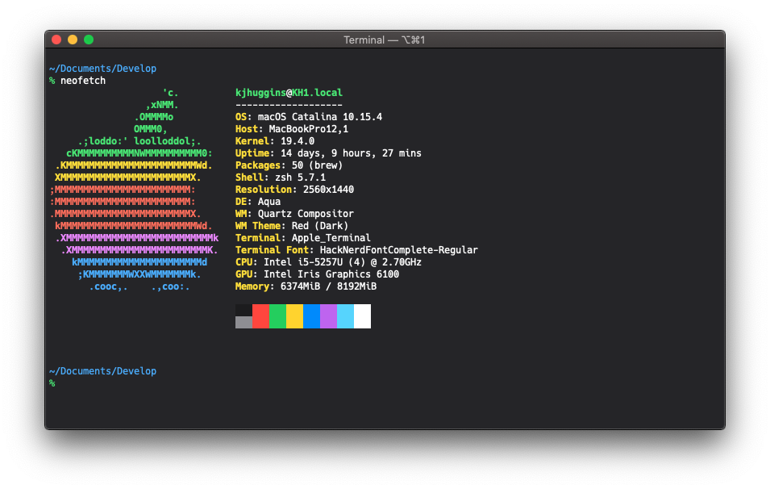

# 

This is a profile (or colorprofile) for both the macOS Terminal and iTerm2. It's a dark theme based off of the default dark palette of system colors outlined in Apple's [Human Interface Guidelines](https://developer.apple.com/design/human-interface-guidelines/ios/visual-design/color/). That said, it fits right in alongside the dark mode that comes in macOS.

## Screenshot

    

## Usage (Terminal.app)
1. [Download the latest profile for Terminal](https://raw.githubusercontent.com/kjhx/shrewsbury-terminal/master/Shrewsbury.terminal).
2. Optionally, [download the latest version of the preset font](hack-nerd-font) and install it.
3. Open up Terminal, go to **Preferences**, then **Profiles**.
4. In the bottom left, click the settings cog and select **Import...** before selecting the downloaded file and opening it.
5. Lastly, set it as your default by selecting the new profile and clicking the **Default** button.

  
View profile-specific settings

  
  The differences between this and the basic profile (besides color) are:
  * The preset typeface for this profile is [Hack Nerd Font Complete](hack-nerd-font), a typeface designed for source code that has been patched to include thousands of glyphs from popular iconic fonts.
  * Pasted newlines do not trigger a carriage return* Modified window and tab naming scheme
  * Smaller scrollback & resume buffer
  * Inaudible, visual bell at all times
  * A translucent, blinking cursor
  * Close on exit by default
  * Option as meta key

## Usage (iTerm2)
1. [Download the latest color profile for iTerm2](https://raw.githubusercontent.com/kjhx/shrewsbury-terminal/master/Shrewsbury.itermcolors).
2. Open up iTerm2, go to **Preferences**, then **Profiles**.
3. Navigate to the **Colors** tab.
4. In the bottom right, click on **Color Presets...** and select **Import...** before selecting the downloaded file and opening it.

[hack-nerd-font]: https://github.com/ryanoasis/nerd-fonts/tree/v2.1.0/patched-fonts/Hack
