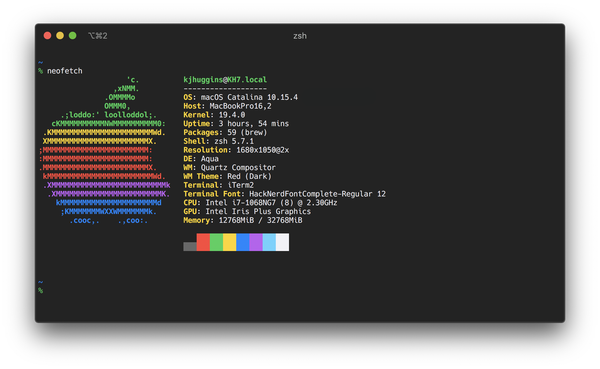

# 

This is a profile (color scheme + some other options) for the macOS Terminal. It's based off of the system colors outlined in Apple's [Human Interface Guidelines](https://developer.apple.com/design/human-interface-guidelines/ios/visual-design/color/). That said, it fits in well with the current macOS dark mode.

## Screenshot

    

## Profile
The preset typeface for this profile is [Hack Nerd Font Complete](https://github.com/ryanoasis/nerd-fonts/tree/v2.1.0/patched-fonts/Hack), a typeface designed for source code that has been patched to include thousands of glyphs from popular iconic fonts.

The colors, in hex, are:
|          |Black  |Red    |Green  |Yellow |Blue   |Magenta|Cyan   |White  |
|:---------|:------|:------|:------|:------|:------|:------|:------|:------|
|**Normal**|#1C1C1E|#FF6961|#30DB5B|#FFD426|#409CFF|#DA8FFF|#70D7FF|#F2F2F7|
|**Bright**|#8E8E93|#FF453A|#30D158|#FFD60A|#0A84FF|#BF5AF2|#64D2FF|#FFFFFF|

## Usage
1. Download this repo.
2. Open up Terminal, go to **Preferences**, then **Profiles**.
3. In the bottom left, click the settings cog and select **Import...**. Navigate to the download file and open it.
4. Lastly, set it as your default by selecting the new profile and clicking the **Default** button.